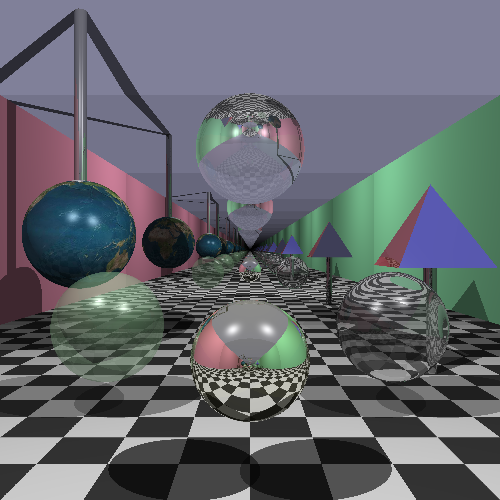

# Ray Tracer Illusion

## Introduction

This project creates a set of 3D objects with global illumination using the ray tracing technique. The following objects are included in the scene:
- Basic Objects
    - 1 green transparent hollow sphere
    - 1 mirror-like reflective sphere
    - Cast shadows for all objects, and light shadows for transparent and refractive objects
    - 1 pyramid made from 5 planes
    - 1 room made from 6 planes
    - 1 floor with chequer pattern
- Objects with Extra Features
    - 2 glass-like spheres with different refractive indices
    - 2 light sources, making multiple shadows and specular highlights
    - Anti-aliasing
    - 1 sphere textured using an image of earth
    - Multiple reflections between 2 mirror-like walls
    - 2 silver cylinders, one connecting the earth globe to the ceiling and one connecting the pyramid and the floor

## Building Commands

**Step 1**: Go to src folder and start a terminal at the location

**Step 2**: Run `cmake CMakeLists.txt`.

**Step 3**: Run `make`.

**Step 4**: Start the program with command `./RayTracer.out`.

## Screenshots

